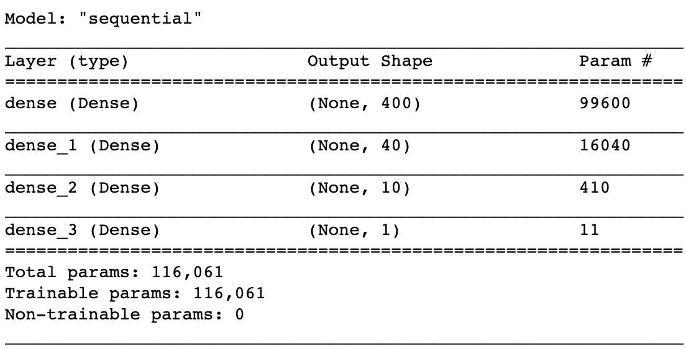
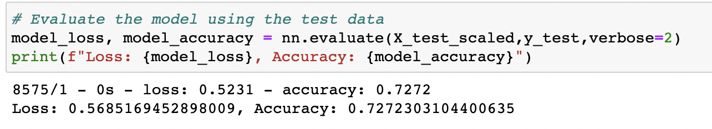
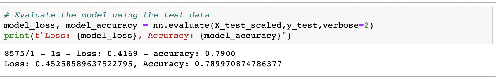

# Neural_Network_Charity_Analysis

## Overview of Project:
Welcome to the Neural Network Charity Analysis project! This initiative aims to process and prepare charity data for a robust Neural Network Model. Our journey begins with a thorough ETL (Extract, Transform, Load) process, followed by model compilation, training, and evaluation. The primary objective is to enhance the model's predictive capabilities, especially since our initial model's accuracy fell short of the desired 75 percent threshold.

## Resources

To accomplish our goals, we've leveraged a range of resources and tools:

Jupyter Notebooks:

AlphabetSoupCharity.ipynb: Initial notebook for data exploration and preprocessing.
AlphabetSoupCharity_Optimization.ipynb: Notebook for model optimization.
Saved Models:

AlphabetSoupCharity.h5: Initial model before optimization.
AlphabetSoupCharity_Optimization.h5: Optimized model.
Data Source:

charity_data.csv: The dataset containing charity-related information.
Libraries and Frameworks: We've harnessed the power of various Python libraries and frameworks, including:

----------------------------------------------------------------------

Pandas: For data manipulation and preprocessing.
SciKit Learn: For machine learning tasks.
TensorFlow and Keras: For building and training our Neural Network.
PySpark: For scalable data processing.

## Results:

Data Preprocessing
In the initial stages, our focus was on preprocessing the data to ensure it's ready for the Neural Network. We had a variety of features to work with, including:

### Columns of Charity 
❌ EIN (Identification number)
📈 NAME (Identification name)
✅ APPLICATION_TYPE (Alphabet Soup application type)
✅ AFFILIATION (Affiliated sector of industry)
✅ CLASSIFICATION (Government organization classification)
✅ USE_CASE (Use case for funding)
✅ ORGANIZATION (Organization type)
✅ STATUS (Active status)
✅ INCOME_AMT (Income classification)
✅ SPECIAL_CONSIDERATIONS (Special consideration for application)
✅ ASK_AMT (Funding amount requested)
Ⓜ️ IS_SUCCESSFUL (Was the money used effectively)

Our journey to enhance model performance was iterative and involved several key steps. Initially, our model accuracy fell below our target, primarily due to the exclusion of the NAME column. To improve this, we experimented with the model architecture by increasing the number of layers and neurons.

Ultimately, our optimized neural network comprises three hidden layers in the following order: 440 | 40 | 10. These layers utilize the activation functions Relu | Sigmoid | Sigmoid | Sigmoid. This modification pushed our accuracy above the crucial 75% threshold.

Despite achieving success, there's room for further improvement. Data noise and column sorting could be refined, even though we surpassed our goal by 4%.

Key Questions:

Were we able to meet the target model performance?
What steps were taken to enhance model performance?

## Summary:
Through meticulous optimization efforts, we managed to boost the accuracy of our deep learning model to an impressive 79%. The pivotal optimization step was the inclusion of the sorted NAME data. Although increasing the number of layers and neurons had a modest impact, further exploration and transformation of noisy data and column sorting hold the potential for additional enhancements. We recommend a detailed exploration of data bins, particularly for rare occurrences in columns, as a strategy for further boosting model performance. In conclusion, delving deeper into data exploration and transformation can be the key to achieving even greater accuracy in our charitable donation prediction model.
